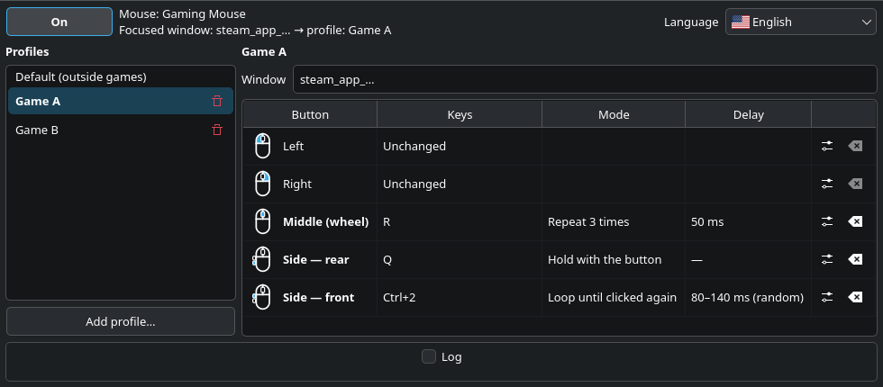
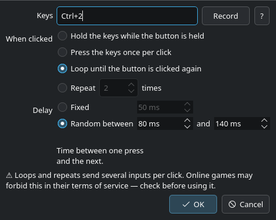

<p align="center"></p>

# LinMBC

Per-application mouse button remapping for Linux (Wayland first), inspired by
[X-Mouse Button Control](https://www.highrez.co.uk/downloads/xmousebuttoncontrol.htm)
for Windows.

LinMBC is an independent project and is not affiliated with Highrez.

> **Status:** alpha (0.1.0a1). Usable on KDE Plasma 6 (Wayland); tested on
> CachyOS with Last Epoch (Steam/Proton). Expect rough edges and please
> [report what breaks](https://github.com/JohnsonMauro/linmbc/issues).

Website: <https://johnsonmauro.github.io/linmbc-site/>



<p align="center"></p>

## What it does

- Remaps the buttons of any evdev mouse to keys or key combos, per game.
- Each button can **hold** the keys, press them **once**, **toggle** a loop
  (until clicked again) or **repeat** them N times, with a fixed or random
  delay.
- Switches profiles automatically when the focused window changes (KDE
  Plasma). Outside a game the `Default` profile applies.
- "Add profile" lists your installed Steam games and fills in the window match.
  It also lists the windows focused since LinMBC started: pick one and the
  match is filled in. Games that share a window class (Lutris ones are all
  `steam_app_default`) are matched by their window title, e.g. `Diablo IV`.
- Every physical mouse is used automatically, including hotplug.
- GUI in English, Português (Brasil), Español, Français, Deutsch, Русский,
  Polski, 日本語, 한국어 and 简体中文 (machine translated, review welcome).

Planned: shift layers, key sequences, a tray icon and a manual profile switch.

## Supported systems

| | |
|---|---|
| **Tested** | Arch Linux / CachyOS, KDE Plasma 6 on Wayland, systemd |
| **Works, with a limit** | Other desktops: buttons are remapped, but only with the `Default` profile (the focused window is read through KWin) |
| **Not tested yet** | Other distributions (Debian/Ubuntu, Fedora, openSUSE…), Plasma on X11 |
| **Not supported** | Distributions without systemd-logind (the device permission rule relies on `uaccess`); headless systems |

Requirements: Python 3.12+, `python-evdev`, PySide6, `dbus-python`, PyGObject.

## Install

### Arch Linux / CachyOS

Prebuilt package from the
[releases page](https://github.com/JohnsonMauro/linmbc/releases) (alphas are
pre-releases): download the `.pkg.tar.zst` and its `.sha256`, then

```bash
sha256sum -c linmbc-*.pkg.tar.zst.sha256
sudo pacman -U linmbc-*.pkg.tar.zst
```

The package is not signed, so install it from the downloaded file
(`pacman -U <url>` requires a signature by default).

Or build it yourself:

```bash
git clone https://github.com/JohnsonMauro/linmbc.git
cd linmbc/packaging/arch
makepkg -si
```

The package installs the app, the udev rule that gives your user access to
mice (and only mice), a systemd user service, the menu entry and the icon.
pacman reloads udev for you.

Then start the daemon now and at every login:

```bash
systemctl --user enable --now linmbc.service
```

Open **LinMBC** from the application menu (if the daemon is not running, the
app starts it) and switch it **On**. The daemon remembers that choice.

To update, install the new release's package (or pull and run `makepkg -si`
again), then `systemctl --user restart linmbc.service`.

### Other distributions

Not packaged or tested yet. What a package needs, from `packaging/`:

- `udev/70-linmbc.rules` → `/usr/lib/udev/rules.d/`
- `systemd/linmbc.service` → `/usr/lib/systemd/user/` (expects `/usr/bin/linmbc-daemon`)
- `linmbc.desktop` → `/usr/share/applications/`, and
  `src/linmbc/icons/linmbc.svg` → `/usr/share/icons/hicolor/scalable/apps/`

### Uninstall

```bash
systemctl --user disable --now linmbc.service
sudo pacman -R linmbc
```

Your profiles stay in `~/.config/linmbc/`; delete that folder to remove them.

## Files

| What | Where |
|---|---|
| Profiles (one TOML file per game) | `~/.config/linmbc/profiles/` |
| Daemon settings | `~/.config/linmbc/config.toml` |
| Daemon log | `~/.local/state/linmbc/daemon.log` |

## How it works

```
mouse ──evdev──▶ linmbc-daemon ──uinput──▶ virtual mouse + keyboard ──▶ compositor/apps
                     ▲
     KWin script ────┘ (D-Bus: focused window → profile)
                     ▲
     LinMBC (GUI) ───┘ (D-Bus: on/off, state; edits the profile files)
```

- The daemon runs as a systemd user service, so remapping keeps working after
  the GUI is closed.
- It reads **mouse devices only** and never opens a keyboard.
- If anything goes wrong it releases every mouse, so your mouse goes back to
  normal.

## A note on games

Remapping one button to another key is a 1:1 input change. Macros and turbo
send several inputs per press, which some online games forbid in their terms of
service. Check the rules of the game before using them.

## Development

```bash
python3 -m venv --system-site-packages .venv && .venv/bin/pip install -e '.[dev]'
.venv/bin/pytest
.venv/bin/linmbc-daemon     # foreground; Ctrl+C releases every mouse
.venv/bin/linmbc
```

The udev rule must be installed (or the package) for the daemon to open the
mouse. `makepkg` packages the **committed** HEAD only: commit before building
to include local changes.

`scripts/gui_screenshots.py` renders the GUI in every language (offscreen,
fake daemon) for the website and `docs/`.

With the package installed, the GUI starts the packaged daemon through
systemd; to run a checkout, stop the service and start `.venv/bin/linmbc-daemon`
first.

## License

[MIT](LICENSE). Flag icons from [flag-icons](https://github.com/lipis/flag-icons)
(MIT).
